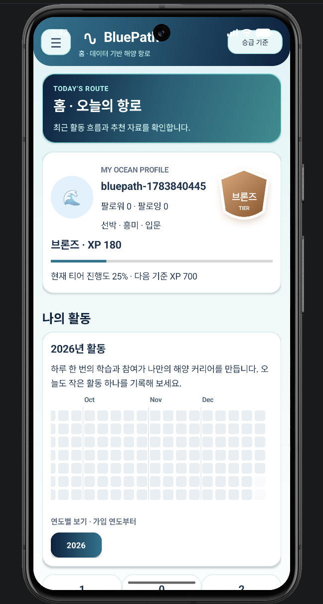

# BluePath — Data-Driven Ocean Skill Navigator

 

BluePath is an Android learning and career-navigation platform that turns marine videos, museum programs, training courses, quizzes, community activity, visitor-demand data, and NCS-oriented career competencies into an explainable personal learning route.

Instead of showing disconnected recommendations, BluePath connects discovery, learning, field experience, assessment, project evidence, and career preparation in one Smart Nautical Chart. Learners can generate or refresh an AI-assisted route for a target career, preview the expected effect of each activity, verify field missions through signed one-time QR codes, and keep verified achievements in an Ocean Skill Passport. Institutions can review demand, participation, mastery gaps, and program outcomes through an administrator dashboard.

<div align="center">

[Product Specification](docs/APP_SPEC.md) · [Developer Setup](docs/DEVELOPER_SETUP.md) · [Marine AI Setup](docs/MARINE_LLM_SETUP.md) · [Fine-Tuning Guide](docs/FINE_TUNING_GUIDE.md)

</div>

## Product Flow

The learner experience follows a commercial-app style entry flow:

1. A full-screen **BLUEPATH** introduction with ocean graphics and service highlights
2. Sign-in, account creation, or password-reset request
3. First-time ocean-talent profile setup
4. The authenticated app shell with a collapsible sidebar
5. AI Career Counseling, Home, Learning Materials, Quiz, Schedule, Ocean Community, and MY
6. A personalized Smart Nautical Chart linking learning, experience, assessment, and career goals
7. Verified field missions and progress stored in the Ocean Skill Passport

The bottom navigation has been removed. Every tab begins with an introduction panel that explains its purpose and how its data is used.

## Core Features

### Smart Nautical Chart

The Home screen creates an explainable route from the learner’s current profile and activity history to a selected marine career.

- Seven route modes: balanced, fastest, experience, family, career, weekend, and free-first
- Route generation and refresh based on interests, goals, level, mastery, schedules, and NCS-oriented competencies
- Ordered route nodes for online learning, museum experience, quizzes, projects, and career preparation
- Future-effect simulation showing expected mastery, readiness, and weak-item changes before an activity starts
- Recommendation reasons and institutional evidence displayed with each route
- Manual rerouting for deadline, time, or difficulty constraints
- Background inactivity detection that can prepare an alternative route and notify the learner before activation

The deterministic engine owns ordering, expected gains, readiness calculation, and route constraints. AI is used to improve grounded explanations and personalized guidance without replacing the calculated scores.

### Signed QR Field Missions

Museum and field missions use signed QR payloads instead of trusting plain text input.

A mission QR can contain:

- Exhibit code
- Session identifier
- Issue and expiration times
- One-time nonce
- Server signature

The server validates the signature, expiration time, session, mission ownership, and nonce before accepting completion. A used nonce cannot be reused, and repeated verification returns the existing result without granting skill points or creating duplicate completion events.

### Explainable Recommendations

Recommendations consider:

- Profile interests and learning goals
- Integrated tier and prerequisite level
- Topic mastery gaps discovered through quizzes
- Saved, started, and completed learning history
- Audience suitability and schedule freshness
- Museum, training, event, and institution records
- NCS-oriented career competencies
- Visitor-survey demand signals
- Community participation
- Source provenance

Every content, schedule, route, and career card can show why it was recommended instead of presenting an unexplained score.

### Verified Learning Completion

Opening a video does not immediately mark it complete or grant XP. The app records a learning start, requires a minimum learning interval, and asks the learner to submit a short reflection before completion is recognized.

This separates:

- `started`: the resource was opened
- `completed_with_reflection`: minimum time and a learning reflection were verified

Verified completion contributes to topic-level skill mastery and the learner’s Ocean Skill Passport.

### Quiz Integrity and Skill Mastery

Promotion quizzes use delayed grading and detailed explanations, while repeated attempts cannot be exploited for unlimited XP.

- First successful promotion: full achievement XP
- Improvement over a previous best score: limited improvement XP
- Same or lower repeated score: no XP
- Every answer becomes topic-level skill evidence

The **MY** tab displays mastery and evidence counts for marine environment, marine life, navigation, ships, maritime culture, safety, and port logistics.

### Ocean Community

Ocean Community provides authenticated social learning through:

- Free and question boards
- Posts, comments, and nested replies
- Emoji reactions
- User following
- Required unique nicknames
- Shared profile images
- Unified tier badges
- Community activity reflected in the learner activity heatmap

The community uses the same learner identity and progression context shown in Home and MY.

### Ocean Skill Passport

MY is an authenticated personal ocean passport that includes:

- One unified tier with a tier-colored shield and progress gauge
- Verified learning and mission completions
- Saved resources and opportunities
- Topic mastery progress bars
- Quiz attempts and best scores
- Nickname-based profile and profile-image upload
- Follower and following counts
- Cloud synchronization and catalog refresh
- Learning and qualification reminders
- Guardian consent management
- Diamond evidence and review status
- Logout and local-data reset

### Natural-Language Search and Marine AI

Learning Materials and Schedule each provide a natural-language search box. AI Career Counseling combines learner profile data, current tier, app knowledge, and optional live retrieval.

The search and counseling layers can:

- Interpret learner intent expressed in everyday language
- Retrieve relevant video, program, training, event, and career records
- Explain why the results match
- Cite retrieved titles, organizations, and source URLs
- Fall back to bundled app data and rule-based explanations when remote AI services are unavailable

The backend grounds AI responses in reviewed app data. Production deployments can require configured language, embedding, and web-search services so an accidentally unconfigured AI environment does not silently present fallback output as fully connected AI output.

Dates, qualifications, laws, and application availability should still be confirmed through the latest official source.

### Institution Dashboard and Program Studio

The administrator console combines learner demand and verified operational data to support institutional planning.

- Learner interest and goal distribution
- Topic mastery gaps
- Learning-record activity
- Content supply by topic
- Visitor-survey evidence
- Enrollment and attendance records
- Pre- and post-assessment outcomes
- Data-driven program recommendations
- AI-assisted, editable education-program drafts

Prototype signals derived from content or route-node creation are kept separate from actual participant, attendance, and assessment metrics.

## Bundled Institutional Data

The offline catalog includes extracted records from the provided sample datasets:

| Data source | Records |
|---|---:|
| Marine education videos | 28 |
| Museum education programs | 43 |
| Korea Institute of Maritime and Fisheries Technology courses | 49 |
| Museum events and experiences | 50 |
| Marine institutions | 88 |
| Verified offline quiz bank | 57 |
| Visitor survey responses used for aggregate insights | 43 |

## Authentication and Security

Authentication is required before entering the app shell. The backend supports:

- Account registration and sign-in
- Required unique nickname validation
- Generic password-reset requests that do not reveal whether an account exists
- Hashed, expiring, one-time reset tokens
- A built-in `/reset-password` page
- SMTP delivery in configured environments
- Development reset-link logging when SMTP is not configured
- Android Keystore-backed access-token storage
- Route ownership checks for route and node access
- Signed, expiring, one-time mission QR verification
- Idempotent mission completion and reward processing

Production deployments must use HTTPS, trusted SMTP settings, rotated secrets, and environment-specific credentials.

## Sidebar Navigation

The app shell uses a closable left sidebar with 7 entries.
The sidebar can be dismissed with the close button or background scrim.

## Promotion Rules

| Promotion | Requirement |
|---|---:|
| Bronze → Silver | 7 or more correct out of 10 |
| Silver → Gold | 9 or more correct out of 12 |
| Gold → Platinum | 10 or more correct out of 15 |
| Platinum → Diamond | 16 or more correct out of 20, plus approved certification and project evidence |

The learner’s effective tier uses the stronger verified result from XP and quiz progression, while Diamond requires all advanced evidence conditions.

## Backend Quality Checks

The backend test suite covers:

- Registration, authentication, cloud sync, quiz generation, and Diamond progression
- Route generation, simulation, rerouting, ownership isolation, and activation
- Signed QR issuance, nonce validation, idempotent mission completion, and reward protection
- Community posts, nested comments, reactions, following, nickname validation, and shared profile data
- Admin content, quiz, spreadsheet import, RAG knowledge, participation metrics, and program drafts
- Natural-language learning and schedule search
- Quiz grounding and option validation
- Password-reset privacy, one-time use, and successful password change

Run:

```bash
pytest -q backend/tests/test_api.py
```

Run the live AI integration check only in an environment with configured credentials:

```bash
RUN_LLM_INTEGRATION=1 pytest -q backend/tests/test_llm_integration.py
```

## Android Build

Configure the API endpoint in `developer.properties`, a Gradle property, or an environment variable:

```properties
BLUEPATH_API_BASE_URL=https://your-api.example.com/
```

Then run:

```bash
./gradlew testDebugUnitTest lintDebug assembleDebug
```

Camera-based QR scanning should also be verified on a physical Android device before deployment.

## Clean Submission Package

External submission archives should include source, tests, migrations, documentation, Gradle wrapper files, build configuration, deployment configuration, and `.env.example`.

Do not include:

- `.env`
- `.git`
- `.idea`
- `.gradle`
- `local.properties`
- `developer.properties`
- generated `build` directories
- macOS metadata files

Use the included clean-submission script when preparing an archive for external delivery.

## Documentation

| Document | Description |
| --- | --- |
| [Product Specification](docs/APP_SPEC.md) | Product definition, target users, learner flow, tier system, recommendation model, community experience, and AI examples |
| [Developer Setup](docs/DEVELOPER_SETUP.md) | Android API configuration, backend environment setup, administrator workflow, search providers, and test commands |
| [Marine AI Setup](docs/MARINE_LLM_SETUP.md) | Server-side marine AI architecture, RAG grounding, validation, optional live retrieval, and fallback behavior |
| [Fine-Tuning Guide](docs/FINE_TUNING_GUIDE.md) | Dataset generation, LoRA training, evaluation, model serving, and backend integration |

BluePath turns ocean curiosity into an explainable and verifiable route from discovery, through learning and assessment, to field experience, institutional education, and marine careers.
