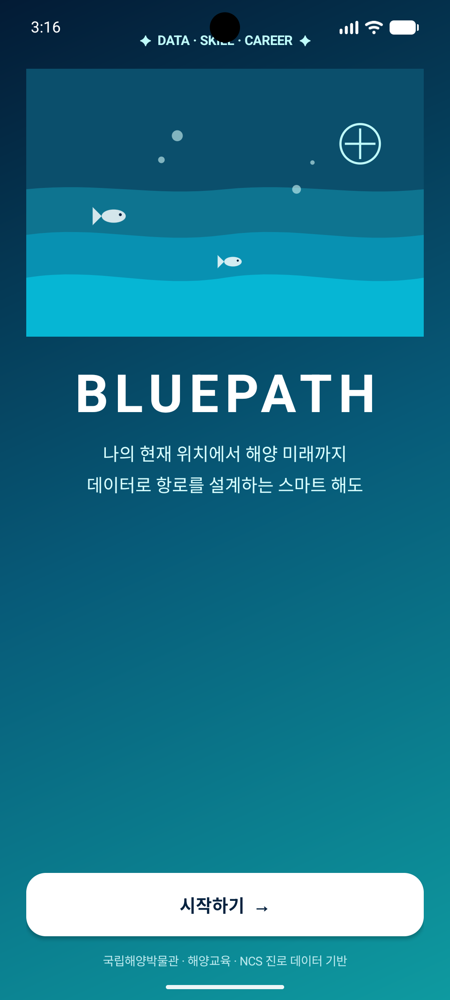

# BluePath — Data-Driven Ocean Skill Navigator



BluePath is an Android learning and career-navigation platform that converts marine videos, museum programs, training courses, visitor-demand data, quizzes, and NCS-oriented career competencies into an explainable personal route.

## Product Flow

The learner experience now follows a commercial-app style entry flow:

1. A full-screen **BLUEPATH** introduction with ocean graphics and service highlights
2. Sign-in, account creation, or password-reset request
3. First-time ocean-talent profile setup
4. The authenticated app shell with a collapsible sidebar
5. Home, Learning, Quiz, Schedule, Career, AI, and MY

The bottom navigation has been removed. Every tab begins with a designed introduction panel that explains what the tab is for and how its data is used.

## What Makes BluePath Different

BluePath does not stop at a generic content recommendation. It connects evidence across the learner journey:

- Profile interests and goals
- Verified video completion and reflection
- Quiz performance by marine topic
- Topic-level skill mastery and evidence counts
- Current integrated tier
- Museum and maritime-training schedules
- NCS-oriented career competencies
- Real marine-institution records
- Visitor-survey demand signals
- Source-grounded RAG responses

Every content, schedule, and career card can show why it was recommended instead of presenting an unexplained score.

## Bundled Institutional Data

The offline catalog includes the full extracted records from the provided sample datasets:

| Data source | Records |
|---|---:|
| Marine education videos | 28 |
| Museum education programs | 43 |
| Korea Institute of Maritime and Fisheries Technology courses | 49 |
| Museum events and experiences | 50 |
| Marine institutions | 88 |
| Verified offline quiz bank | 57 |
| Visitor survey responses used for aggregate insights | 43 |

Programs and events retain source labels and dates. Expired records are explicitly shown as **종료·아카이브** and are not presented as currently available enrollment opportunities.

## Explainable Recommendation Route

Recommendations consider:

- Interest and topic alignment
- Integrated tier and prerequisite level
- Career and qualification goal alignment
- Topic mastery gaps discovered through quizzes
- Saved, started, and completed learning history
- Audience suitability
- Schedule freshness
- Source provenance

Cards display concise recommendation reasons such as interest match, current mastery, schedule status, and original dataset source.

## Verified Learning Completion

Opening a video no longer marks it complete or grants XP. The app records a learning start, requires a minimum learning interval, and asks the learner to submit a short reflection before completion and XP are recognized.

This separates:

- `started`: the resource was opened
- `completed_with_reflection`: minimum time and a learning reflection were verified

The completion evidence also contributes to the learner’s topic-level Ocean Skill Passport.

## Quiz Integrity and Skill Mastery

Promotion quizzes still use delayed grading and detailed explanations, but repeated failure can no longer be exploited for unlimited XP.

- First successful promotion: full achievement XP
- Improvement over a previous best score: limited improvement XP
- Same or lower repeated score: no XP
- Every answer becomes topic-level skill evidence

The **MY** tab displays mastery and evidence counts for marine environment, marine life, navigation, ships, maritime culture, safety, and port logistics.

## Ocean Skill Passport

MY is an authenticated personal ocean passport, not a login screen. It includes:

- Integrated tier, XP tier, and quiz tier
- Verified learning completions
- Saved resources and opportunities
- Topic mastery progress bars
- Quiz attempts and best scores
- Profile editing
- Cloud synchronization and catalog refresh
- Learning and qualification reminders
- Guardian consent management
- Diamond evidence and review status
- Logout and local-data reset

## Source-Grounded Marine AI

The backend seeds RAG knowledge from every bundled source rather than only video descriptions:

- Education programs and training courses
- Events and archive records
- Marine institutions
- Visitor-survey insights
- Curated NCS-oriented career routes
- Existing reviewed marine knowledge

Answers and generated quizzes can cite retrieved titles, organizations, and URLs. Dates, qualifications, law, and application availability should still be confirmed through the latest official source.

## Ocean Demand Radar

The administrator console includes an institutional demand dashboard that combines:

- Learner interest distribution
- Learning-goal distribution
- Topic mastery gaps
- Learning-record activity
- Content supply by topic
- Visitor-survey evidence
- Data-driven program recommendations

This allows an institution to identify topics with high demand, low mastery, or insufficient program supply instead of using BluePath only as a learner-facing catalog.

## Authentication and Password Reset

Authentication is required before entering the app shell. The backend supports:

- Account registration
- Sign-in
- Generic password-reset requests that do not reveal whether an account exists
- Hashed, expiring, one-time reset tokens
- A built-in `/reset-password` page that consumes the one-time token
- SMTP delivery in configured environments
- Development reset-link logging when SMTP is not configured
- Android Keystore-backed access-token storage

Production deployments must configure HTTPS for `PASSWORD_RESET_BASE_URL` and trusted SMTP settings.

## Sidebar Navigation

The app shell uses a closable left sidebar with these entries:

- 홈
- 학습
- 퀴즈
- 일정
- 진로
- AI
- **MY**

The sidebar includes the signed-in account identity and can be dismissed by the close button or background scrim.

## Promotion Rules

| Promotion | Requirement |
|---|---:|
| Bronze → Silver | 7 or more correct out of 10 |
| Silver → Gold | 9 or more correct out of 12 |
| Gold → Platinum | 10 or more correct out of 15 |
| Platinum → Diamond | 16 or more correct out of 20, plus approved certification and project evidence |

The learner’s effective tier uses the stronger verified result from XP and quiz progression, while Diamond requires all advanced evidence conditions.

## Backend Quality Checks

The backend test suite covers:

- Registration, authentication, cloud sync, quiz generation, and Diamond progression
- Admin content, quiz, spreadsheet import, and RAG knowledge management
- Quiz grounding and option validation
- Password-reset privacy, one-time use, and successful password change
- Ocean Demand Radar response structure

Run:

```bash
pytest -q backend/tests/test_api.py
```

## Android Build

Configure the API endpoint in `developer.properties`, a Gradle property, or an environment variable:

```properties
BLUEPATH_API_BASE_URL=https://your-api.example.com/
```

Then build normally:

```bash
./gradlew test assembleDebug
```

BluePath turns ocean curiosity into an explainable and verifiable route from discovery, through learning and assessment, to institutional education and marine careers.
