# BluePath — Data-Driven Ocean Skill Navigator


**Android 7.0+ · BluePath 1.4.1 · Java 17 · FastAPI · PostgreSQL/pgvector**

BluePath is an Android learning and career-navigation platform that turns marine videos, museum and training programs, quizzes, schedules, community participation, institutional data, and NCS-oriented competencies into one explainable growth journey.

Most learning services stop at content recommendations. BluePath connects **what to learn, why it matters, how progress is verified, which competency improved, what career it supports, and what to do next**. Learners receive a Smart Nautical Chart toward a target marine career, progress through a unified tier system, review consistency through an activity heatmap, inspect evidence in the Ocean Skill Map, and export a shareable Ocean Skill Passport. Institutions can use the same demand and outcome signals to improve education programs.

<div align="center">

[Product Specification](docs/APP_SPEC.md) · [Developer Setup](docs/DEVELOPER_SETUP.md) · [Marine AI Setup](docs/MARINE_LLM_SETUP.md) · [Fine-Tuning Guide](docs/FINE_TUNING_GUIDE.md)

</div>

## Why BluePath Is Different

| Differentiator | What BluePath does |
| --- | --- |
| **Route, not a feed** | Orders learning, experience, assessment, project, and career actions into a goal-driven Smart Nautical Chart. |
| **Progression with multiple proofs** | Combines XP, promotion quizzes, and advanced evidence into one tier displayed consistently across Home, Community, and MY. |
| **Consistency made visible** | Converts daily attendance, learning, and community activity into a year-scale heatmap with streak and annual summaries. |
| **Evidence-based competency profile** | Translates quiz answers and verified learning records into topic mastery, evidence counts, career readiness, and next-step projections. |
| **Grounded AI with deterministic boundaries** | Uses AI for intent understanding and explanations while route ordering, scoring, prerequisites, gains, and constraints remain auditable. |
| **Learner-to-institution feedback loop** | Connects learner demand and mastery gaps with participation, attendance, assessment, and program-planning data. |

## Product Experience

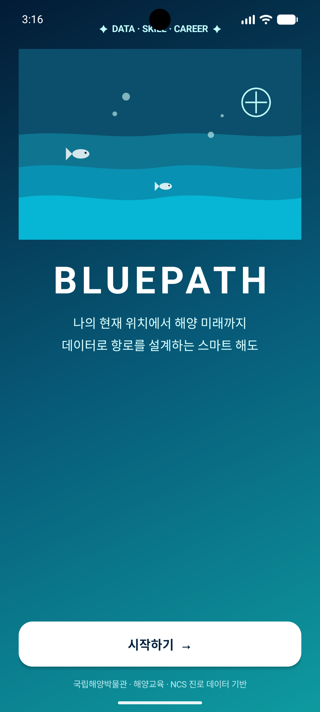

The learner flow is:

1. Full-screen BLUEPATH introduction
2. Sign-in, account creation, or password-reset request
3. First-time ocean-talent profile setup
4. Guardian-consent flow for applicable younger learners
5. Home dashboard with tier progress, attendance, activity heatmap, recommendations, and Smart Nautical Chart
6. Learning, quiz, schedule, AI career counseling, community, and MY experiences
7. Ocean Skill Passport review and PDF portfolio sharing

The authenticated app uses a fixed five-item bottom navigation:

- **Home**
- **Learning** — videos, papers, and promotion quizzes
- **AI Career Counseling**
- **Ocean Community**
- **MY**

Schedule is opened from the calendar action in the header. During an active quiz, navigation actions are hidden to keep the attempt focused. Each section provides a compact help action explaining its purpose and data use.

## Core Features

### 1. Smart Nautical Chart

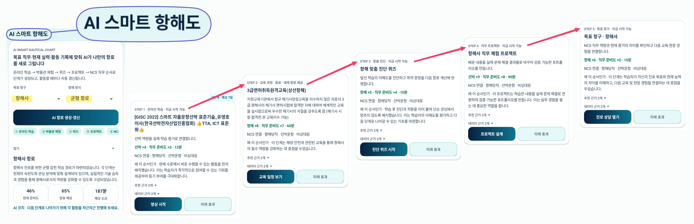

The Smart Nautical Chart turns a target career into an ordered, explainable route rather than a disconnected list of recommendations.

- Seven route modes: balanced, fastest, experience-first, family, career preparation, weekend, and free-first
- Route planning based on interests, goals, current tier, topic mastery, prior activity, schedule conditions, and NCS-oriented competencies
- Ordered nodes spanning online learning, museum or training experience, quizzes, applied projects, and career exploration
- Future-effect simulation before starting a node, including expected mastery and career-readiness changes
- Recommendation reasons and institutional evidence attached to route steps
- Manual rerouting for closure, limited time, difficulty, weekend-only, or free-only constraints
- Inactivity detection that can prepare a shorter alternative route without replacing the current route until the learner accepts it

The deterministic route engine owns ranking, node ordering, prerequisites, expected gains, duration, readiness calculations, and rerouting constraints. A configured language model may improve grounded explanations, but it does not overwrite those calculated values.

### 2. Unified Tier System


BluePath uses one effective tier across the learner profile, Home, quizzes, Community, and MY. The effective tier follows the strongest verified progression path available to the account.

#### XP progression

| Tier | XP range or threshold |
| --- | ---: |
| Bronze | 0–699 XP |
| Silver | 700+ XP |
| Gold | 1,600+ XP |
| Platinum | 2,800+ XP |
| Diamond | 4,200+ XP |

#### Promotion-quiz progression

| Promotion | Requirement |
| --- | ---: |
| Bronze → Silver | 7 or more correct out of 10 |
| Silver → Gold | 9 or more correct out of 12 |
| Gold → Platinum | 10 or more correct out of 15 |
| Platinum → Diamond evidence route | 16 or more correct out of 20, plus approved certification and marine-project evidence |

Tier integrity rules prevent repeated attempts from becoming an unlimited XP source:

- First successful promotion grants the main achievement reward.
- A later personal-best improvement may grant only a limited improvement reward.
- The same or a lower repeated score grants no additional XP.
- Detailed answer explanations and topic-level evidence are still recorded after grading.

Tier-colored shield components and progress gauges make progression visually consistent throughout the app.

### 3. Yearly Activity Heatmap and Streaks

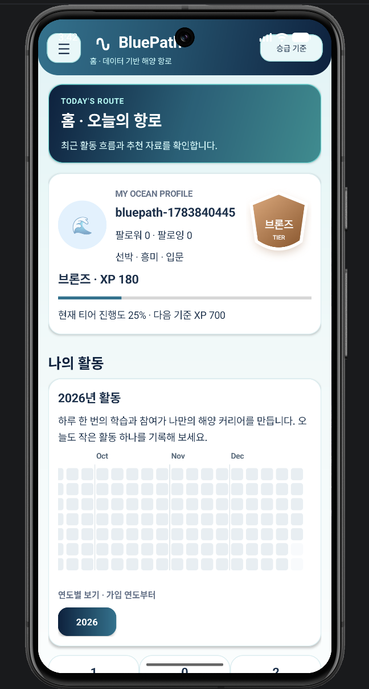

The Home dashboard includes a horizontally scrollable annual heatmap that makes learning consistency visible at a glance.

- Daily cells become darker as activity volume increases
- Recent months open in view, with earlier months available by horizontal scrolling
- Monthly active-day count, yearly activity total, longest yearly streak, and current streak are summarized below the chart
- Attendance, learning activity, community posts and comments, and supported experience records contribute to the timeline
- Local and synchronized daily records are merged conservatively to reduce duplicate counting after cloud sync

This is not only a decorative attendance calendar. It gives learners a retention signal and links social participation and learning behavior to the same growth history.

### 4. Explainable Recommendations

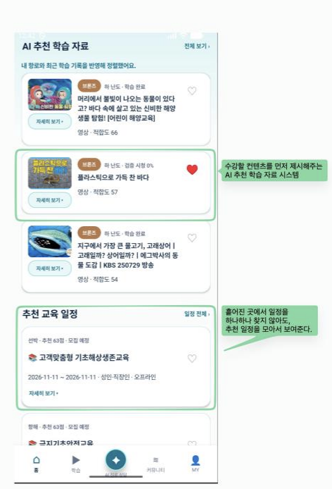

Recommendations can account for:

- Profile interests, age group, level, and learning goal
- Effective tier and prerequisites
- Topic mastery gaps discovered through quizzes
- Saved, started, and completed learning history
- Audience suitability and schedule freshness
- Museum, training, event, and institution records
- NCS-oriented career competencies
- Visitor-survey demand signals
- Community participation
- Source provenance

Learning, schedule, route, and career cards can show the reasons behind a recommendation instead of exposing only an unexplained score.

### 5. Verified Learning Completion

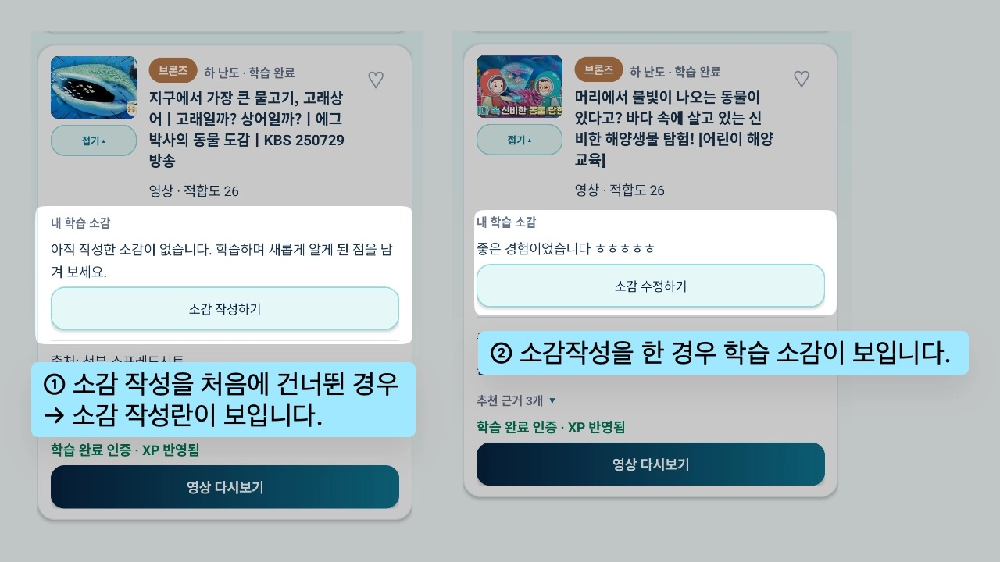

Opening a resource does not immediately make it a completed achievement. BluePath distinguishes intent from evidence.

- `started`: the learner opened the resource and a start record was created
- `completed_with_reflection`: the required learning interval elapsed and a short reflection was submitted

Verified completion can update XP, topic mastery, evidence counts, activity history, and the Ocean Skill Passport. This prevents a simple content open from being treated as meaningful learning completion.

### 6. Quiz Integrity and Topic Mastery

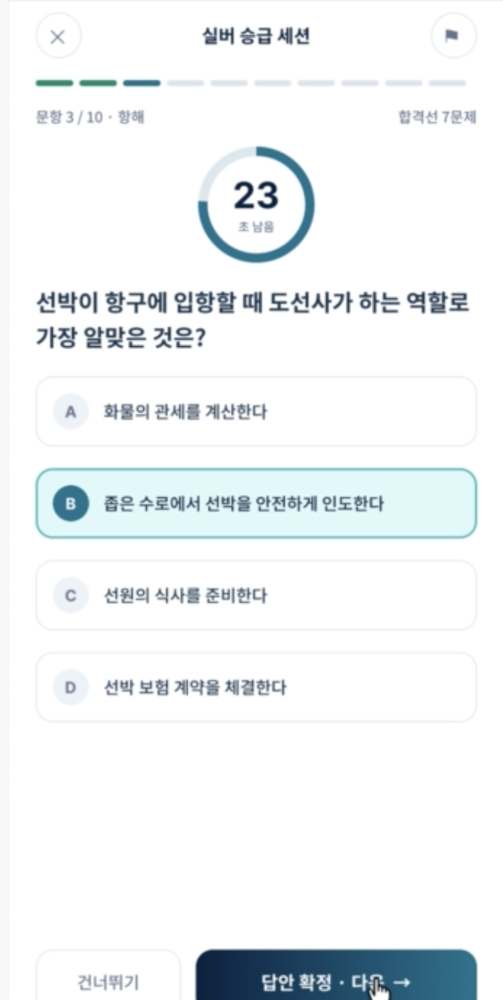

Promotion quizzes use four-option questions, delayed grading, an explicit pass line, and answer-by-answer explanations.

Every answer can become evidence for one of seven marine competency areas:

- Marine environment
- Marine life
- Navigation
- Ships
- Maritime culture
- Safety
- Port logistics

The same topic evidence feeds the Ocean Skill Map and career-readiness calculation, so quizzes influence more than a single total score.

### 7. Ocean Community

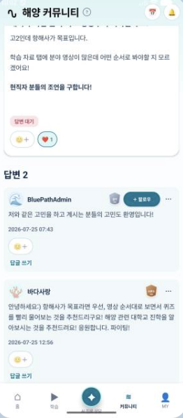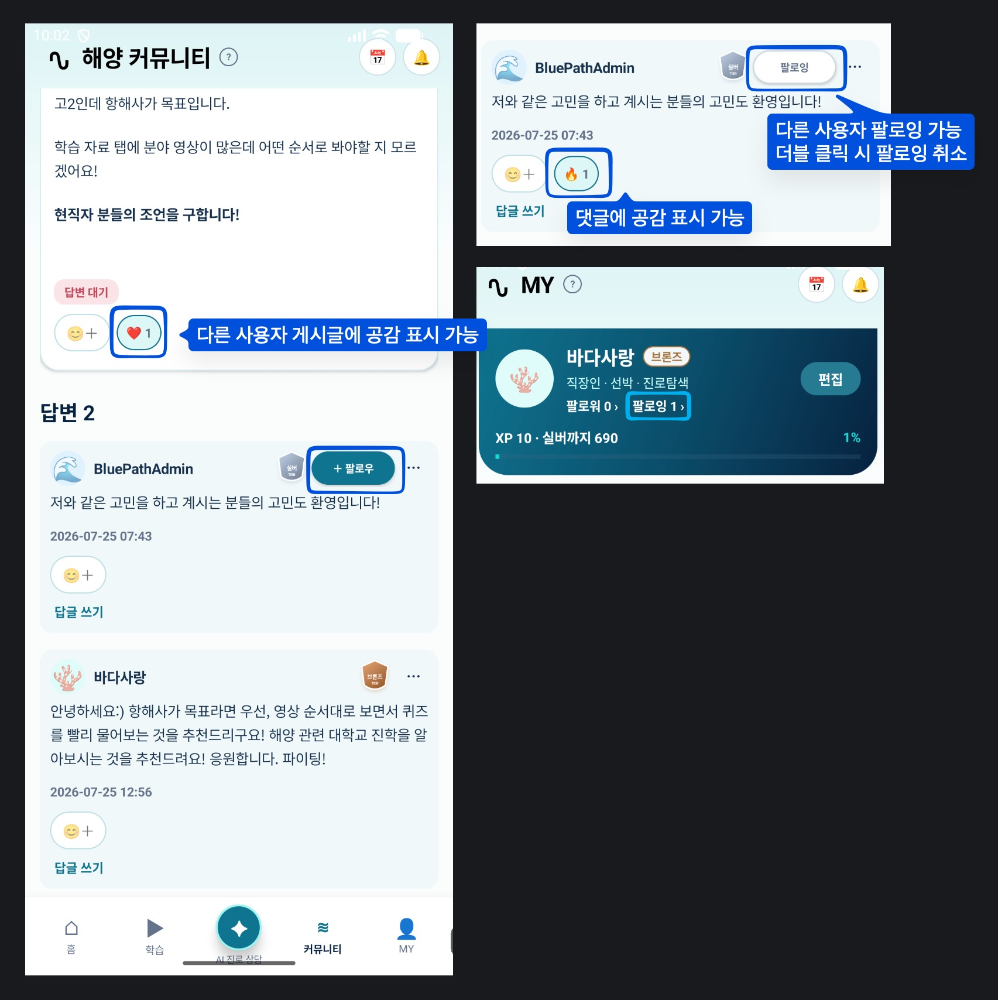

Ocean Community provides authenticated social learning with the learner’s real progression context.

- Free and question boards
- Posts with optional images and tags
- Comments and nested replies
- Accepted answers on question posts
- Emoji reactions
- User following, follower lists, and profile views
- Unique nicknames and shared profile images
- Unified tier shields on profiles and discussions
- Search, category, tag, sort, and following-scope filters
- Reporting and blocking controls
- Community posts and comments reflected in the activity heatmap

### 8. Ocean Skill Passport and Interactive Skill Map

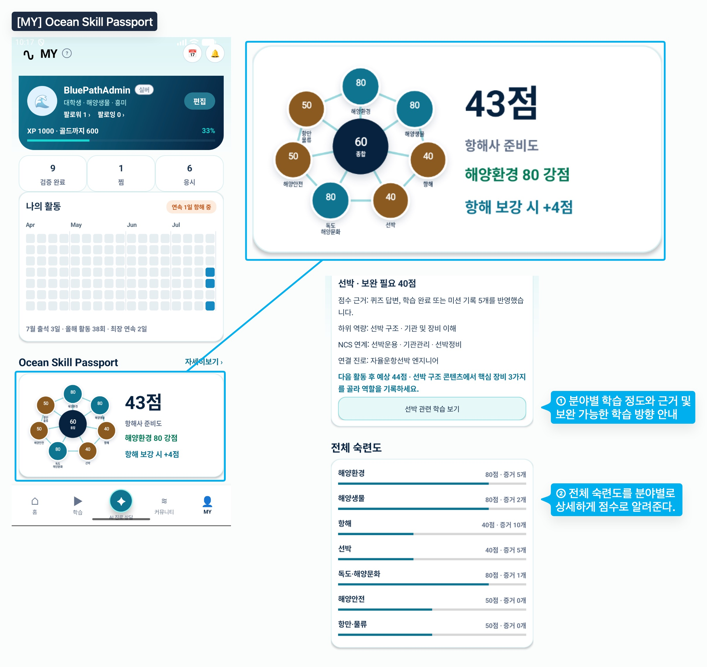

MY turns activity records into a reusable evidence portfolio.

- Interactive constellation-style Ocean Skill Map
- Topic mastery scores and evidence counts
- Overall skill average and target-career readiness
- Node details showing score basis, sub-skills, NCS-oriented competencies, connected careers, and the next recommended activity
- Projected next score for weaker areas
- Verified learning reflections, quiz results, experience badges, and advanced-review status
- Clear separation between app-verified activity and externally approved evidence
- PDF portfolio generation and Android share-sheet delivery through a scoped `FileProvider`
- Evidence code derived from the current portfolio snapshot
- Saved resources, quiz history, profile editing, follower counts, synchronization, reminders, consent management, and account reset

### 9. Natural-Language Search and Marine AI

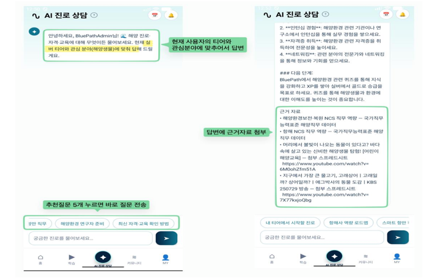

Learning Materials and Schedule support natural-language search, while AI Career Counseling combines profile data, effective tier, mastery, app knowledge, and optional live retrieval.

The search and counseling layers can:

- Interpret goals expressed in everyday language
- Retrieve relevant videos, papers, programs, training courses, events, institutions, and careers
- Explain why results match the learner
- Cite retrieved titles, organizations, and source locations
- Suggest the next activity or promotion step
- Fall back to bundled data and rule-based explanations when remote AI services are unavailable

The backend grounds responses in reviewed app data. Production deployments can require configured language, embedding, and web-search services so an incomplete AI environment fails clearly instead of silently presenting fallback output as fully connected AI output.

Dates, qualifications, laws, and application availability should always be confirmed through the latest official source.

### 10. Schedule, Reminders, and Current-Availability Handling

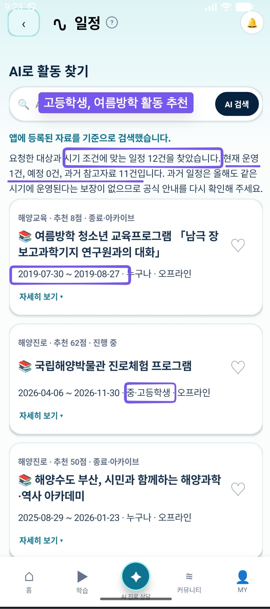

- Calendar-style schedule browsing
- Natural-language program and event discovery
- Tier, interest, target, date, and saved-item context in recommendations
- Archived-item handling so expired records are not presented as currently available opportunities
- Daily learning reminders
- Exam and qualification schedule reminders
- Notification inbox and route-change notifications

### 11. Institution Dashboard and Program Studio

The administrator console connects learner demand with operational education outcomes.

- Interest and goal distribution
- Topic mastery gaps
- Learning-record activity
- Content supply by topic
- Visitor-survey evidence
- Enrollment, attendance, and completion records
- Pre- and post-assessment outcomes
- Route and drop-off analytics
- Data-driven program recommendations
- AI-assisted, editable 30-, 60-, and 90-minute program drafts with competency links and measurement plans

Prototype interaction signals remain separate from actual participant, attendance, completion, and paired-assessment metrics.

## Bundled Data

The Android catalog includes the extracted source records summarized in `app/src/main/assets/dataset_summary.json`.

| Data source | Bundled records |
| --- | ---: |
| Marine education videos | 28 |
| Museum education programs | 477 |
| Maritime training courses | 3,965 |
| Combined program records | 4,442 |
| Museum events and experiences | 343 |
| Marine institutions | 1,082 |
| NCS occupations | 75 |
| NCS competency units | 841 |
| Visitor-survey responses used for aggregate insights | 2,694 |
| Verified offline quiz questions | 57 |

Historical records are useful for discovery, recommendation research, and institutional analysis, but the app treats expired schedules as archived. Current participation details should be checked against the relevant official source.

## Architecture

```text
Android app
  ├─ Local profile, Room learning records, secure token storage
  ├─ Recommendation engine, tier rules, heatmap, skill map, PDF exporter
  └─ Retrofit API client
          │
          ▼
FastAPI backend
  ├─ Authentication, synchronization, community, quizzes, routes, outcomes
  ├─ Deterministic recommendation and Smart Nautical Chart services
  ├─ Grounded AI and optional web retrieval
  └─ PostgreSQL + pgvector
```

### Android

- Java 17
- Android SDK 35, minimum SDK 24
- AppCompat, Lifecycle, Room, WorkManager, Retrofit, Gson, Glide, and WebKit
- Android Keystore-backed access-token storage
- Local-first records with cloud synchronization
- Custom views for the activity heatmap, Ocean Skill Map, tier shields, quiz timer, and promotion celebration

### Backend

- FastAPI and Pydantic
- SQLAlchemy with PostgreSQL
- pgvector-backed retrieval support
- JWT authentication
- Password-reset and optional SMTP delivery
- Community, learning, quiz, route, participation, analytics, and administrator APIs
- Optional OpenAI-compatible language model, embedding provider, web search, and fine-tuned model service

## Authentication, Privacy, and Security

Authentication is required before entering the main app experience. The implementation includes:

- Account registration and sign-in
- Required unique nickname validation
- Generic password-reset responses that do not reveal whether an account exists
- Hashed, expiring, one-time reset tokens
- Android Keystore-backed access-token storage
- Guardian-consent flow for configured younger age groups
- Route and node ownership checks
- Server-authoritative progress fields for XP, quiz tier, mastery, and verified evidence
- Idempotent completion and reward handling where duplicate requests could otherwise create repeated credit
- Scoped `FileProvider` sharing for generated portfolio documents
- Community reporting and user blocking

Production deployments should use HTTPS, strong rotated secrets, trusted SMTP settings, restricted CORS, and environment-specific credentials.

## Local Development

### Prerequisites

- Android Studio with Android SDK 35
- JDK 17
- Docker and Docker Compose
- Python 3.11+ for direct backend development or dataset tooling

### 1. Configure the backend

```bash
cp backend/.env.example backend/.env
```

For local development, replace placeholder secrets and set optional AI requirements according to the services available in your environment.

Start PostgreSQL and the API:

```bash
docker compose up --build db api
```

The default Compose mapping exposes the API at `http://localhost:8002`.

### 2. Configure Android

Create or update `developer.properties`:

```properties
BLUEPATH_API_BASE_URL=http://10.0.2.2:8002/
```

`10.0.2.2` reaches the host machine from the Android emulator. For a physical device, use an HTTPS endpoint or a reachable development-machine address appropriate to the test network.

### 3. Build and test Android

```bash
./gradlew testDebugUnitTest lintDebug assembleDebug
```

Instrumentation smoke test:

```bash
./gradlew connectedDebugAndroidTest
```

### 4. Run backend tests

```bash
pytest -q \
  backend/tests/test_api.py \
  backend/tests/test_dataset.py \
  backend/tests/test_follow_graph.py
```

Run the live AI integration check only with real configured credentials:

```bash
RUN_LLM_INTEGRATION=1 pytest -q backend/tests/test_llm_integration.py
```

## Fine-Tuning and Model Service

The `finetuning/` workspace supports:

- Marine dataset preparation and validation
- LoRA training
- Evaluation and model comparison
- OpenAI-compatible serving
- Backend integration through environment configuration

See [Fine-Tuning Guide](docs/FINE_TUNING_GUIDE.md) and [Marine AI Setup](docs/MARINE_LLM_SETUP.md).

## Clean Submission Package

External archives should include source, tests, migrations, documentation, Gradle wrapper files, build configuration, and deployment templates.

Do not include:

- `.env`
- `.git`
- `.idea`
- `.gradle`
- `local.properties`
- `developer.properties`
- generated `build` directories
- macOS metadata files

Create a clean archive with:

```bash
./scripts/create_clean_submission.sh
```

## Documentation

| Document | Description |
| --- | --- |
| [Product Specification](docs/APP_SPEC.md) | Product definition, target users, learner flow, progression, recommendations, community, and AI examples |
| [Developer Setup](docs/DEVELOPER_SETUP.md) | Android API configuration, backend setup, administrator workflow, providers, and test commands |
| [Marine AI Setup](docs/MARINE_LLM_SETUP.md) | Grounded AI architecture, retrieval, validation, optional live search, and fallback behavior |
| [Fine-Tuning Guide](docs/FINE_TUNING_GUIDE.md) | Dataset generation, LoRA training, evaluation, serving, and backend integration |
| [Voyage Twin](docs/BLUEPATH_1_4_VOYAGE_TWIN.md) | Smart Nautical Chart responsibilities, APIs, persistence, and outcome analytics |

BluePath turns ocean curiosity into an explainable route from discovery and consistent learning to measurable competency, field experience, and marine career preparation.
